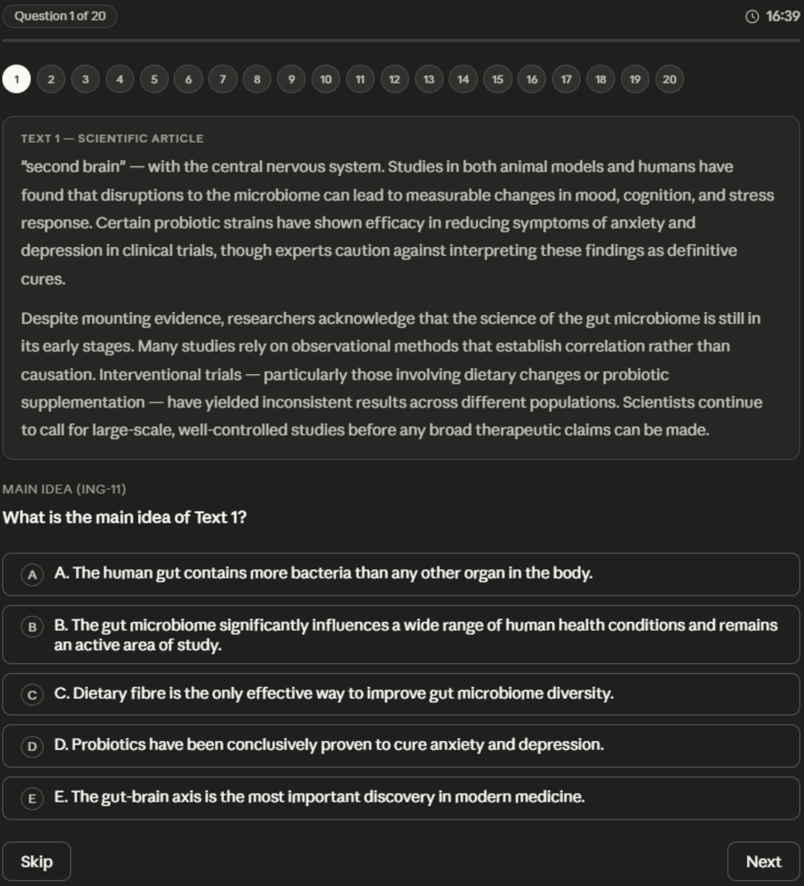
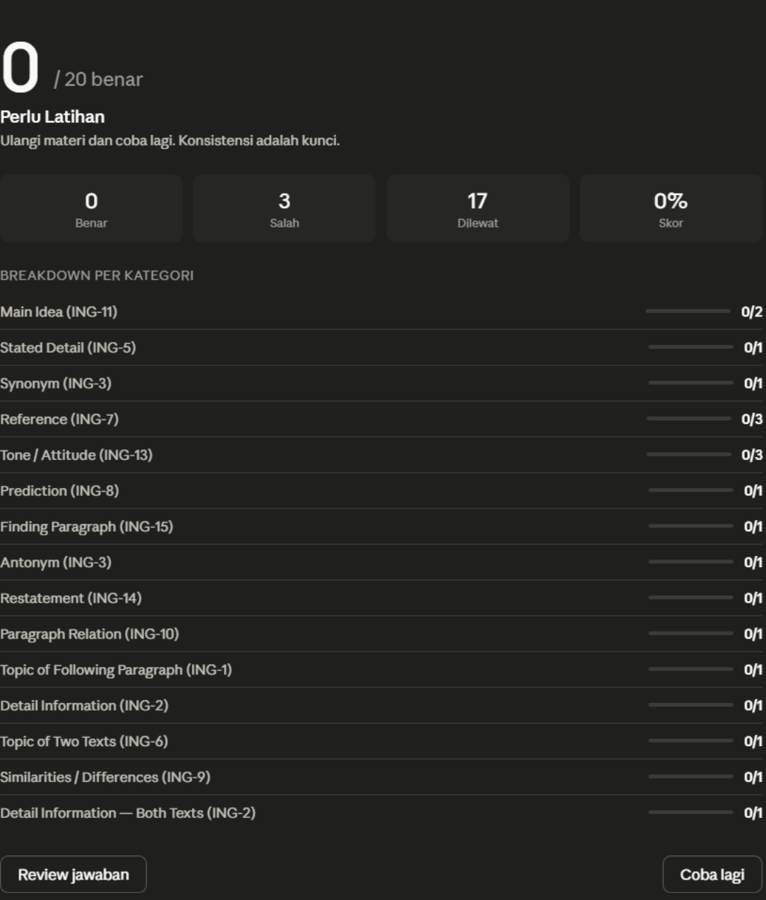
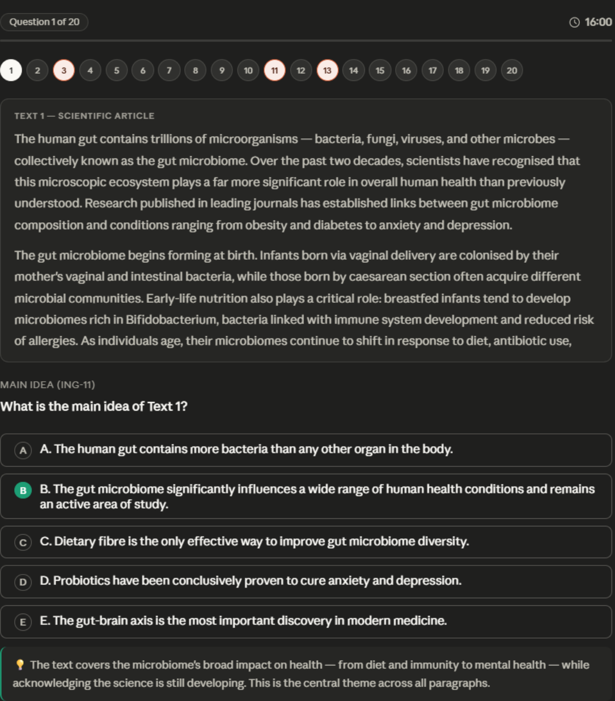

# literasi-bahasa-inggris

> ⚠️ **Prototype** — this is an early version. Full version available via DM [@muqsith.ai](https://www.instagram.com/muqsith.ai/)

A Claude skill for practicing English Literacy questions for TOBK/UTBK exam prep. Made by [@mqsth](https://www.instagram.com/muqsith.ai/).

---

## Preview

<!-- Replace with your own screenshots, place files in the /assets/ folder -->

| Question View | Results & Breakdown |
|---|---|
|  |  |

| Review Mode |
|---|
|  |

---

## How to Use

1. Download `SKILL.md` from this repo
2. Upload to Claude via **Settings > Skills**
3. Type one of the triggers below:

```
literasi bahasa inggris
soal literasi
latihan TOBK
latihan UTBK
latihan inggris
minta soal inggris
```

---

## Features

- 20 multiple choice questions (A–E) per session, always freshly generated
- Based on 2–3 authentic reading texts (150–250 words each)
- Varied topics: science, environment, technology, social, health
- Interactive widget embedded directly in chat — no file download needed
- 20-minute countdown timer (1,200 seconds)
- One-by-one question navigation with dot navigator
- Prev / Skip / Next buttons
- Auto scoring (correct = 1, wrong/blank = 0)
- Results page: score, grade, message, per-category breakdown
- Review mode: correct/wrong highlights + explanation for each question
- "Try again" button for a new session
- Automatically adapts to Claude's light/dark theme

---

## Question Types

| Type | Per Session |
|---|---|
| Tone / Attitude | 2–3 |
| Field of Study | 1–2 |
| Target Readers / The Writer | 1–2 |
| Vocabulary (Synonym / Antonym / Modal) | 2–3 |
| Reference (Pronoun) | 2–3 |
| Restatement | 2–3 |
| Summary / Main Idea | 2–3 |
| Analogy | 1–2 |
| Author's Positive Attitude | 1–2 |
| Irrelevant Sentence | 1–2 |
| Where Specific Info is Found | 1–2 |

---

## Compatibility

Runs on [claude.ai](https://claude.ai) with the Skills feature enabled.

> **Note:** This skill combines Claude's **Skills** and **Visualizer** features. Both run fully on desktop browsers — the interactive widget appears directly inside the chat. Mobile experience may not be optimal due to widget rendering limitations in the Claude mobile app.

Simply put, Skills handles understanding your request and preparing the questions, while the Visualizer displays them as an interactive widget right inside the chat. Since both need enough screen space to work properly, using a browser on a laptop or desktop will give you the best experience.

---

## Full Version

This is the prototype version. For the full version, DM [@muqsith.ai](https://www.instagram.com/muqsith.ai/) on Instagram.

---

Made by **mqsth** · [@muqsith.ai](https://www.instagram.com/muqsith.ai/)

---

## More Skills

Other skills made by **mqsth**:

**SNBT / UTBK**
| Code | Subtest |
|---|---|
| PPU | General Knowledge & Understanding |
| PM | Mathematical Reasoning |
| PK | Quantitative Knowledge |
| LBI | Indonesian Literacy |
| LBE | English Literacy ← you are here |
| PBM | Reading & Writing Comprehension |
| PU | General Reasoning |

**CPNS / SKD**
| Code | Subtest |
|---|---|
| TIU | General Intelligence Test |
| TWK | National Insight Test |
| TKP | Personal Characteristics Test |

**UIN / UMPTKIN**
| Code | Subtest |
|---|---|
| PA UIN | Academic Reasoning |
| PM UIN | Mathematical Reasoning |
| LAI UIN | Islamic Religious Literacy |
| LM UIN | Reading Literacy |

DM [@muqsith.ai](https://www.instagram.com/muqsith.ai/) for access to full versions (non-prototype) and other skills.
